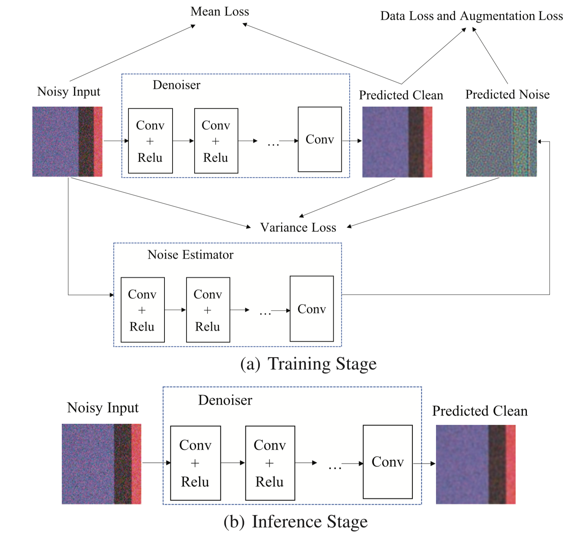

# Noise2Variance

This repository contains the official code of the paper published by IET Image Processing:

**Noise2Variance: Dual networks with variance constraint for self‐supervised real‐world image denoising** 
\[[Paper PDF](https://ietresearch.onlinelibrary.wiley.com/doi/pdf/10.1049/ipr2.13170)\]

**Highlights**: This study demonstrates that a straightforward loss design, concentrating on variance, can effectively train a standard CNN denoiser in a self-supervised fashion.



Benchmark results of the paper are available at:
 + [DND Benchmark Results（sRGB）](https://noise.visinf.tu-darmstadt.de/benchmark/)
 + [SIDD Benchmark Results（sRGB）](http://130.63.97.225/sidd/bench_res_sRGB.html)


## Installation
Clone this repository into any place you want.
```
git clone https://github.com/TomHeaven/noise2variance_pytorch
```
### Dependencies
* Python
* PyTorch>=2.0
* numpy
* Pillow
* torchvision
* scipy


## Expriments
### SIDD validation dataset
To train and evaluate the model directly please visit [SIDD](https://www.eecs.yorku.ca/~kamel/sidd/benchmark.php) website and download the original `Noisy sRGB data` and `Ground-truth sRGB data` from `SIDD Validation Data and Ground Truth` and place them in `data/SIDD_Small_sRGB_Only` folder.

#### Test and Train

You can now go to src folder and test our model by:
```
cd src
sh test.sh
```
The pretrained model configuration and weight of SIDD validation dataset is located at `models/Noise2Variance/0320-121732`.

or you can train it by yourself as follows:
```
sh train.sh
```


### Citation
If you use our paper or code, please cite the the paper:
```
@article{tan2024noise2variance,
  title={Noise2Variance: Dual networks with variance constraint for self-supervised real-world image denoising},
  author={Tan, Hanlin and Liu, Yu and Zhang, Maojun},
  journal={IET Image Processing},
  year={2024},
  publisher={Wiley Online Library}
}
```

### Credits
+ Thanks for [CVF-SID](https://github.com/Reyhanehne/CVF-SID_PyTorch) to share code framework of the repo.
